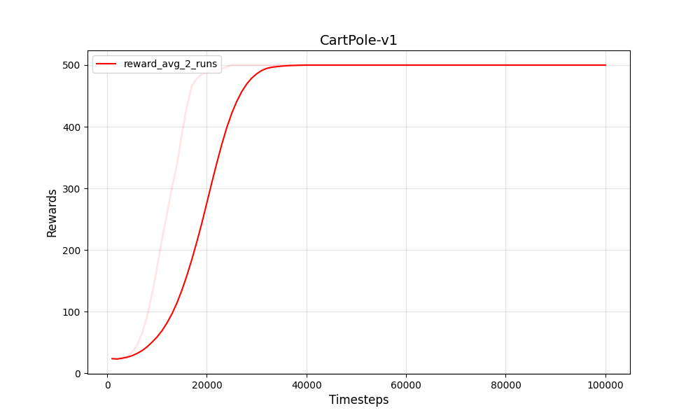
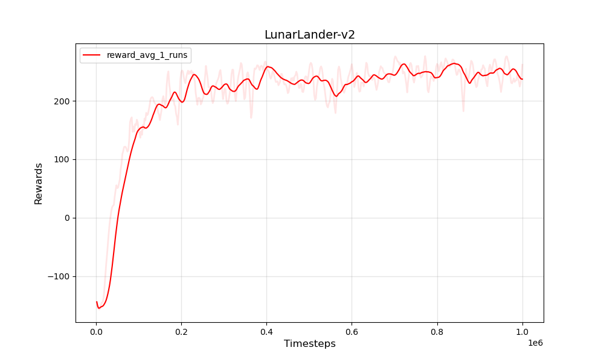
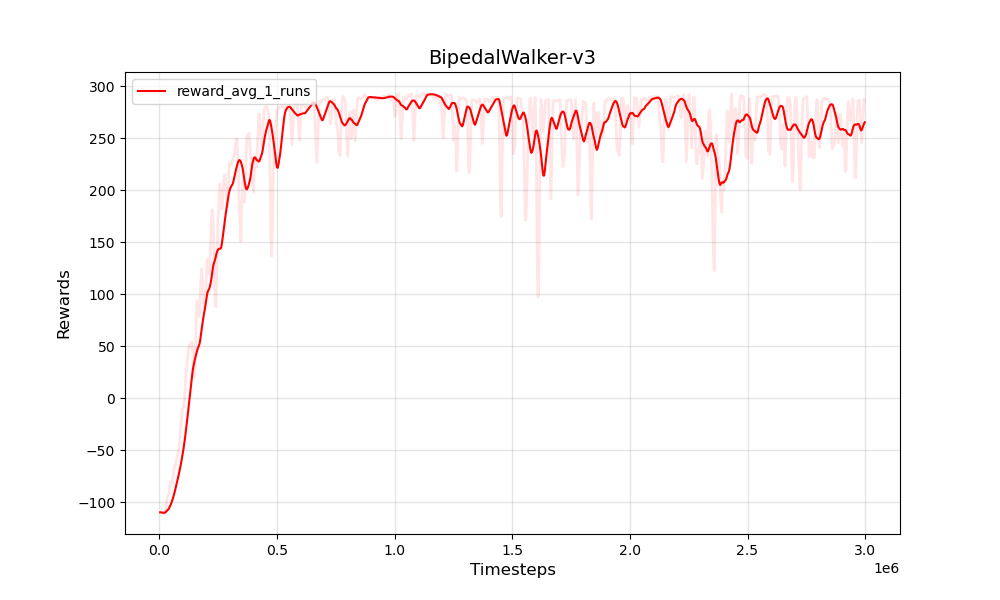

# PPO-GAE-pytorch
_Wenyuan Zhao_

## Introduction

This repository provides a PyTorch implementation of Proximal Policy Optimization (PPO) with clipped objective and GAE for OpenAI gym environments. It can still be used for complex environments but may require some hyperparameter-tuning or changes in the code.

A concise explaination of PPO algorithm can be found [here](https://stackoverflow.com/questions/46422845/what-is-the-way-to-understand-proximal-policy-optimization-algorithm-in-rl).


## Usage

- Train a discrete PPO agent in *CartPole-v1* environment 

  ```
  python train.py \
      --env_name cartpole \
      --seed 1 \
      --pretrained 1 \
      --max_train_steps 5e4 \
      --save_freq 1e4 \
      --batch_size 2048 \
      --mini_batch_size 64 \
      --K_epochs 40
  ```

- Evaluate a pre-trained PPO agent in *CartPole* domain 

  ```
  python eval.py \
      --env_name cartpole \
      --seed 1 \
      --pretrained 1
  ```

- All parameters and hyperparamters to control training and testing are in `env/config.py` file.

* We provide a pre-trained model that can be used directly for evaluation: 

  ```
  python3 eval.py \
      --env_name cartpole \
      --seed 0 \
      --pretrained 0
  ```

#### Note :
  - Device is set to GPU as default if CUDA is available.
  - If the RL environment runs on CPU, use CPU as device for faster training. Box-2d and Roboschool run on CPU and training them on GPU device will be significantly slower because the data will be moved between CPU and GPU often.

## Experimental Results








## Citation

If you find our work useful in your research, please consider citing this repository as follows:

```
@misc{ppo-gae-pytorch,
    author = {Zhao, Wenyuan},
    title = {A PyTorch implementation of Proximal Policy Optimization (PPO)},
    year = {2022},
    publisher = {GitHub},
    journal = {GitHub repository},
    howpublished = {\url{https://github.com/warrenzha/ppo-gae-pytorch}},
}
```
